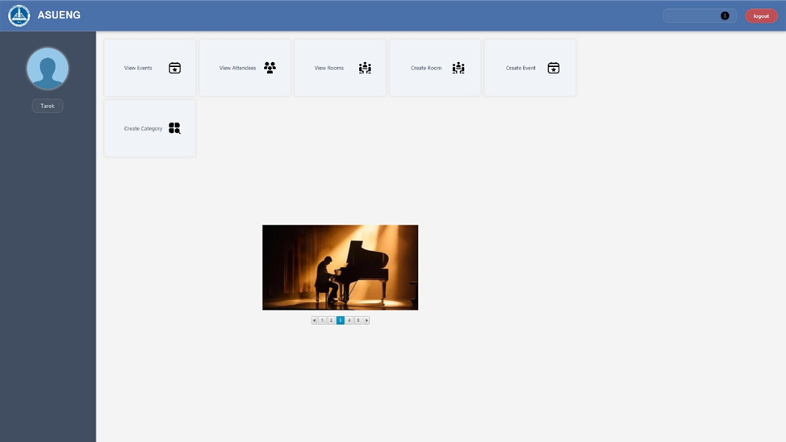
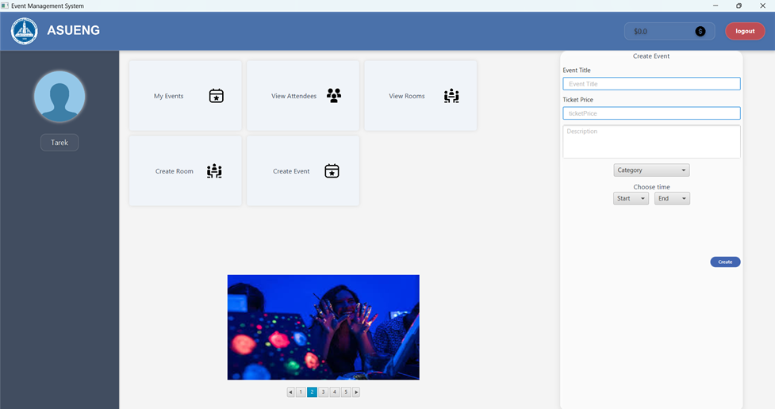
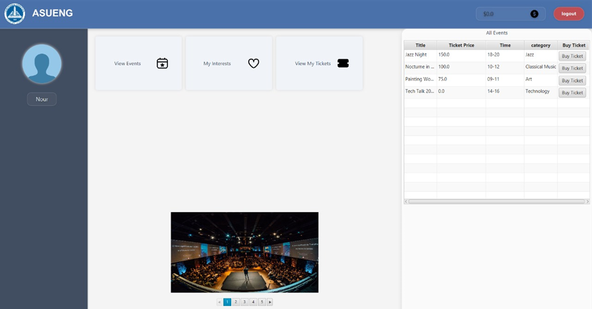

# 📅 Event Management System – Java Desktop App

A full-featured **desktop application** for managing events, attendees, and ticketing, built with **Java** and **JavaFX**. The project focuses on clean architecture, modularity, and user experience, supporting key operations like event creation, ticket generation, and attendee registration.

---

## 🚀 Features

- 🛠️ **Event Management** – Create, edit, and delete events with attributes like name, date, venue, and capacity
- 🎟️ **Ticketing System** – Auto-generate and assign tickets per event
- 🙋‍♂️ **Attendee Management** – Register users, assign tickets, and track attendance
- 🔄 **Event-Attendee Mapping** – Dynamic relationship management between events and registered users
- 🎨 **Interactive GUI** – Built using **JavaFX** for a modern, intuitive experience
- 🧱 **OOP Design** – Clean code structure using principles like encapsulation and abstraction
- 🧪 **Maintainable Codebase** – Modular and scalable architecture for future enhancements

---

## 🖼️ Screenshots

### 🧩 Admin Dashboard

### 📋 Event Creation (Organizer's dashboard)

### 🎟️ Ticket purchase

## ⚙️ How to Run

--- Setup in an IDE (e.g., IntelliJ IDEA, Eclipse) ---

Before running, you need to open the project in an IDE and configure JavaFX.

1. Add JavaFX SDK to Project Libraries:
   Ensure the JavaFX SDK is correctly linked as a dependency for your project.

2. Set VM Arguments (If Needed):
   In your IDE's run configuration for the Main class, you may need to add the following VM arguments.
   
   --module-path /path/to/javafx-sdk/lib --add-modules javafx.controls,javafx.fxml
   
   Note: Make sure to replace /path/to/javafx-sdk/lib with the absolute path to the lib folder inside your JavaFX SDK installation.

--- Build and Run the Project ---

You can run the application directly from your IDE or from the command line.

From Your IDE:
- Run the Main class.

From the Command Line:
1. Compile the Java files:
   javac -cp "lib/*" src/*.java -d out

2. Run the application:
   java -cp "lib/*:out" Main

Enjoy the application!
